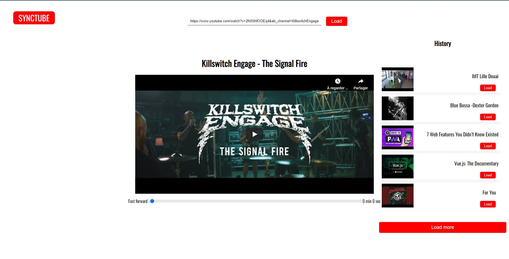

# SYNCTUBE

Une application pour regarder des vidéos youtube en complète synchronisation avec des amis

## fonctionnalitées

- charge toutes les vidéos de youtube
- lorsque qu'un utilisateur lance, met en pause ou avance la vidéo, ces modifications se font pour tous les utilisateurs connectés
- système d'historique

## stack

- Vue.js
- node.js
- express
- mongoDB
- Youtube data APi
- vue-youtube
